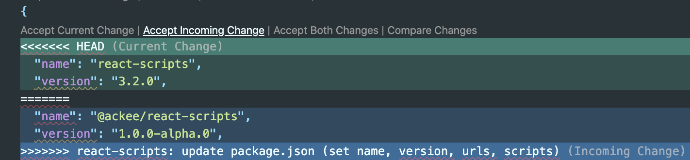

# Custom scripts and configurations

## BE AWARE!

1. #### Do not rename `template.json` to `package.json`.

   If you do so, whole `custom` directory will be ignored during `@ackee/react-scripts` publishing, since the `custom` dir. would be considered as a its own NPM package.

2. #### Try to modify `custom` outer content as least as possible to prevent conflicts during an upgrade to newer `react-scripts` version.
   Of course, there're following and only exceptions: `template`, `template-typescript`, `README.md`, and `CHANGELOG.md`.

---

## Upgrade guide

Upgrade to the latest `react-scripts` version:

1. Set a new `remote` to the original repository
   ```sh
   $ git remote add upstream https://github.com/facebook/create-react-app.git`
   ```
2. Get the latest original repo changes by calling
   ```sh
   $ git fetch upstream
   ```
3. Check out to [the latest tag](https://github.com/facebook/create-react-app/releases), e.g. `v3.2.0`
   ```sh
   $ git checkout v3.2.0 && git checkout -b v3.2.0
   ```
4. Check out back to your `master` branch
   ```sh
   $ git checkout master
   ```
5. Run rebase

   ```sh
   $ git rebase v3.2.0
   ```

   ### Resolving conflicts during ongoing rebase

   - Choose your, incoming changes, since you're the package owner.
     

6. After finishing rebase, delete `v3.2.0` branch
   ```sh
   $ git branch -d v3.2.0
   ```

---

## Before publishing

Try to create a new project locally and run `yarn start` at least.
